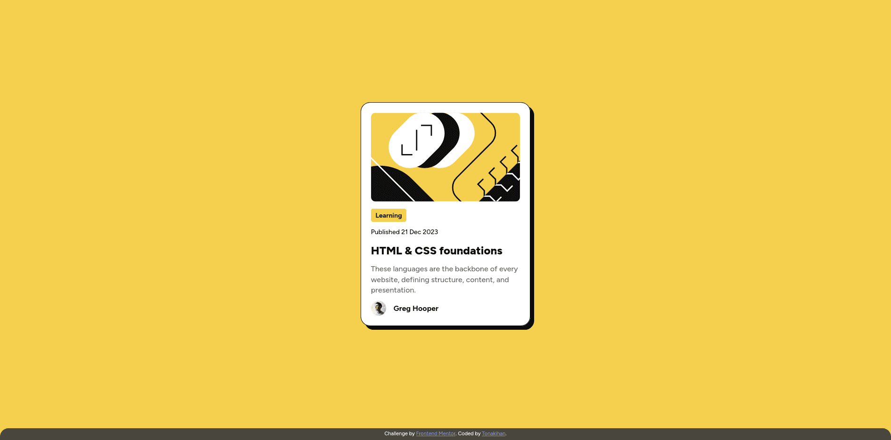

# Frontend Mentor - Blog preview card solution

This is a solution to the [Blog preview card challenge on Frontend Mentor](https://www.frontendmentor.io/challenges/blog-preview-card-ckPaj01IcS). Frontend Mentor challenges help you improve your coding skills by building realistic projects.

## Table of contents

- [Overview](#overview)
  - [The challenge](#the-challenge)
  - [Screenshot](#screenshot)
- [My process](#my-process)
  - [Built with](#built-with)
  - [What I learned](#what-i-learned)
  - [Useful resources](#useful-resources)
- [Author](#author)

## Overview

### The challenge

Users should be able to:
- See hover and focus states for all interactive elements on the page

### Screenshot



## My process

### Built with

- Semantic HTML5 markup
- CSS custom properties
- Flexbox

### What I learned

I'm found property of css:
```css
width: fit-content;
```

### Useful resources

- [MDN](https://developer.mozilla.org/en-US/docs/Web/CSS/Reference)
- [W3School](https://www.w3schools.com/csS/default.asp)

## Author

- Github - [Tonakihan](https://github.com/tonakihan)
- Frontend Mentor - [@tonakihan](https://www.frontendmentor.io/profile/tonakihan)
